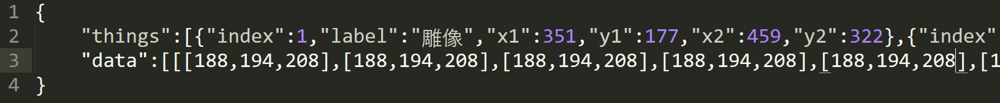
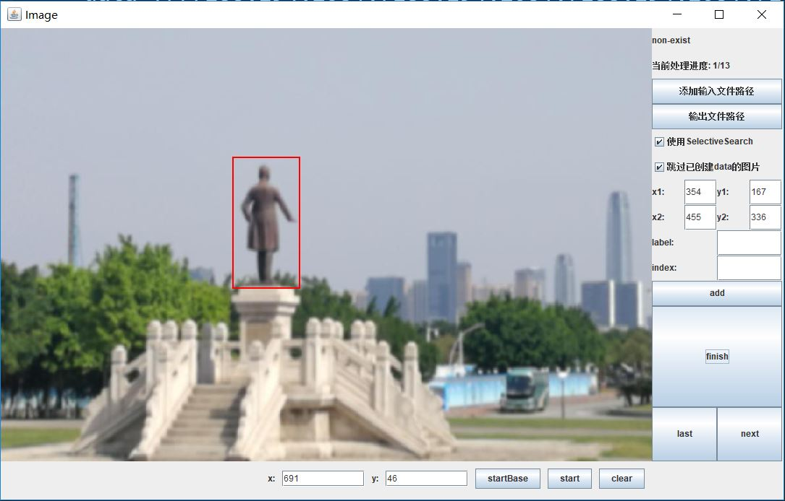

## 功能

- 支持添加多个路径的文件夹

- 支持对输入过一次的label->index进行自动补全

- 支持Selective Search生成0.1<IOU<0.3的背景框图

- 支持一张图片上多个label

- 结果保存在json文件内，data数据为图片的三通道颜色值(RBG)，格式为:
"things":[{"index":序列,"label":"名字","x1":x1,"y1":y1,"x2":x2,"y2":y2}...],
"data":[[第一列各个像素点三通道值(RBG)][第二列]...]

## 使用方法

1.添加输入文件路径

2.输出文件路径

3.在图片上勾选目标框，填写label和index，并点击add添加

4.所有框图添加完成后点击finish结束并生成文件

5.next进入下一张图片

注:下方三个按钮为当前设定参数的SelectiveSearch的演示，参数已经预先设置好，若要更改可以进入SegmentationOptionsSetter类更改